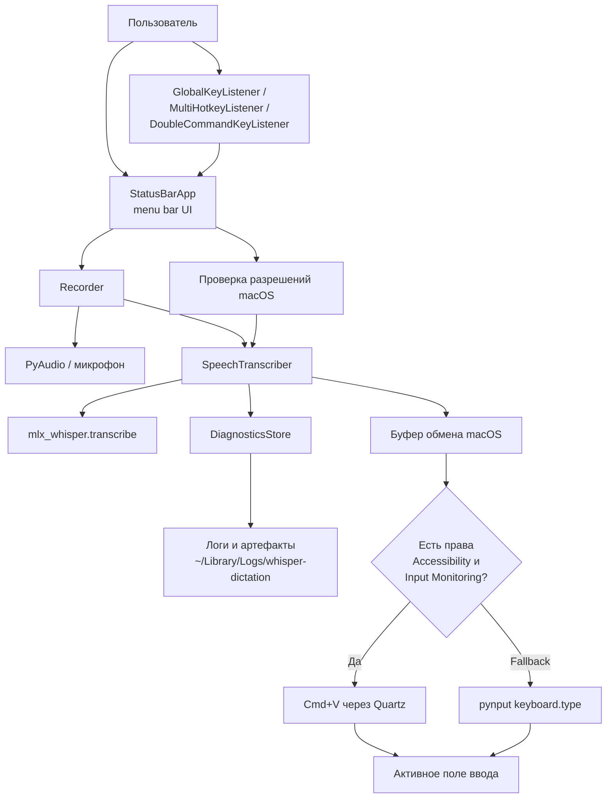

# Архитектура

Ниже показан текущий поток данных и управления в приложении. Диаграмма отражает существующую структуру кода в runtime-модуле и нужна как быстрый ориентир перед дальнейшей декомпозицией на модули.

## Что видно по диаграмме

- Главный orchestration-слой сейчас сосредоточен в одном файле: приложение, слушатели хоткеев, запись, распознавание и часть permission-логики связаны напрямую.
- Надежный fallback уже встроен в поток распознавания: даже при неудачной автовставке текст сначала попадает в буфер обмена.
- Диагностика изолирована в `DiagnosticsStore`, поэтому это уже хорошая точка для дальнейшей модульной декомпозиции.
- Для будущего сайта это полезно как стартовая карта архитектуры, даже до появления более подробных ручных страниц.