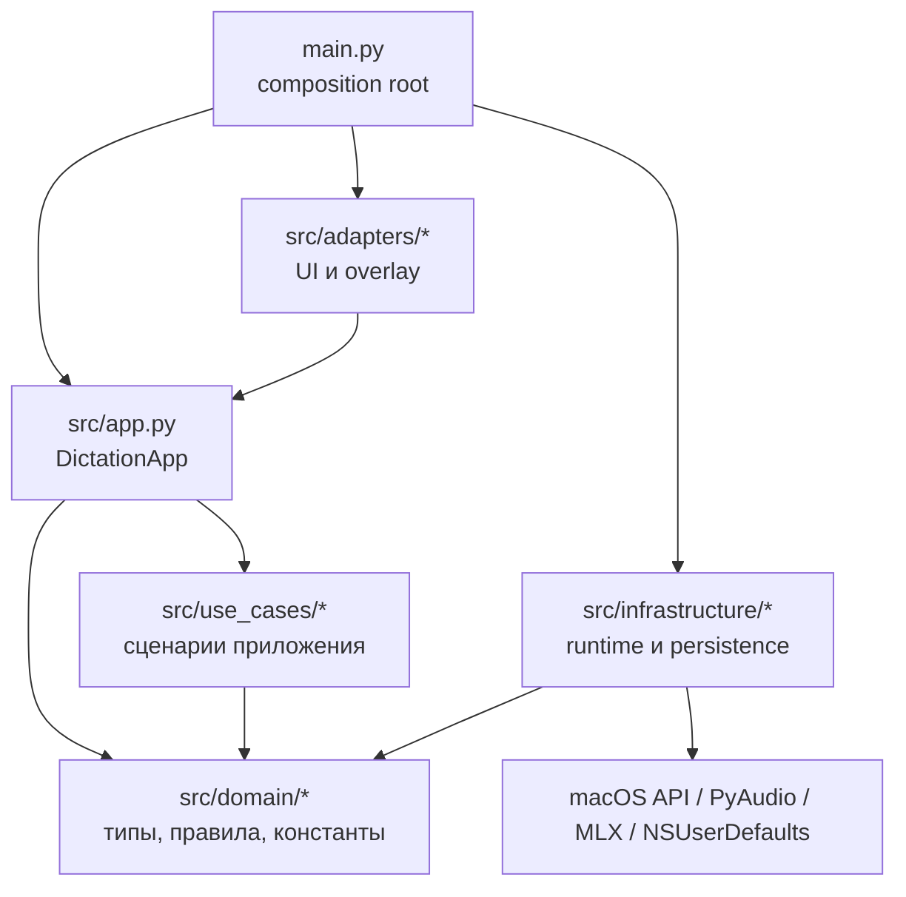

# Архитектура

Проект переведён на слоистую структуру `domain / use_cases / adapters / infrastructure`.
`main.py` остаётся единственным composition root: он собирает concrete runtime-объекты и передаёт их в тонкий координатор `DictationApp`.

## Слои

- `src/domain/`
  - Чистые типы, константы, порты и правила.
  - Здесь живут `constants.py`, `types.py`, `ports.py`, `audio.py`, `transcription.py`, `llm_processing.py`, `hotkeys.py`.
  - Слой не зависит ни от `app`, ни от `use_cases`, ни от adapters/runtime.

- `src/use_cases/`
  - Сценарии приложения: запись, транскрибация, LLM-пайплайн, настройки, хоткеи, быстрые профили микрофона.
  - Получают внешние зависимости через injected services/callables и не импортируют `infrastructure`.

- `src/adapters/`
  - `ui.py` содержит `StatusBarApp`.
  - `overlay.py` содержит `RecordingOverlay`.
  - `hotkey_dialog.py` содержит NSAlert-диалог захвата комбинации клавиш.

- `src/infrastructure/`
  - Низкоуровневый runtime и persistence: запись аудио, Whisper/LLM runtime, ввод текста, права macOS, хоткеи, NSUserDefaults и файловые артефакты.

## Ключевые правила

- `DictationApp` больше не тянет `Foundation`, `NSUserDefaults`, `Recorder` или hotkey runtime напрямую.
- `StatusBarApp` больше не использует магию `__getattr__`/`__setattr__`; UI работает через явные свойства и явный `self.app`.
- Чистые правила распознавания и LLM-обработки вынесены в `src/domain/transcription.py` и `src/domain/llm_processing.py`.
- `SpeechTranscriber` заменён на `TranscriptionUseCases`, а LLM runtime собран вокруг `LlmGateway`.
- Старый `src/config.py` разделён на:
  - `src/domain/constants.py`
  - `src/domain/types.py`
  - `src/domain/ports.py`
  - `src/infrastructure/persistence/defaults.py`

## Практический поток

1. `main.py` создаёт `Recorder`, `DiagnosticsStore`, `Defaults`, `LlmGateway`, persistence-адаптеры и UI-адаптеры.
2. `main.py` собирает `TranscriptionUseCases` и `DictationApp`, передавая все runtime-зависимости через конструктор.
3. `StatusBarApp` подписывается на snapshot `DictationApp` и обновляет menu bar.
4. Use-case сервисы меняют только состояние `DictationApp` и публикуют новый snapshot.
5. Если автовставка не удалась, текст по-прежнему сохраняется через fallback в историю и, при включённой опции, в буфер обмена.
