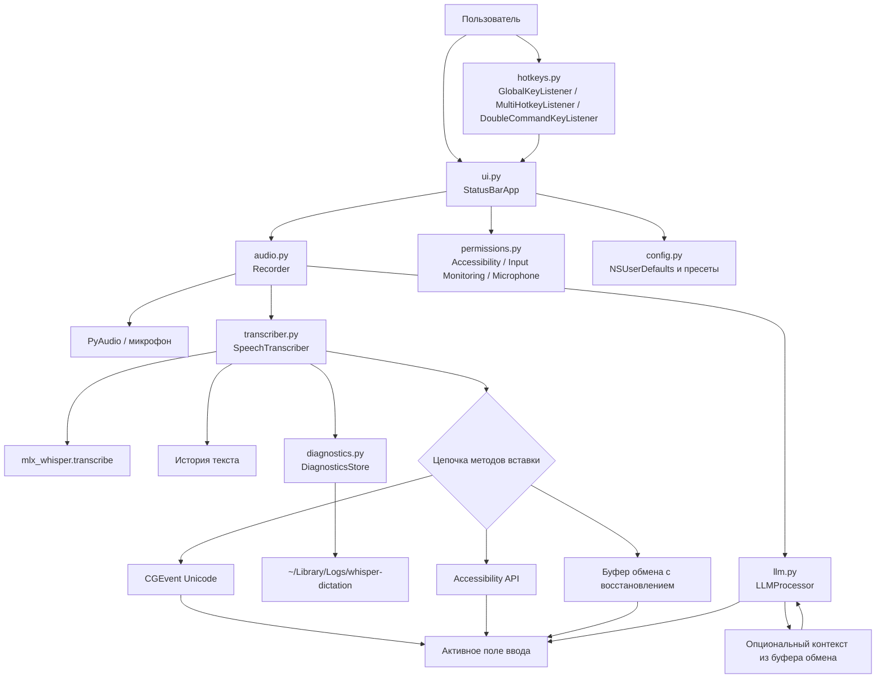

# Архитектура

Ниже показан текущий поток данных и управления в приложении после декомпозиции runtime-кода на отдельные модули в `src/`.

## Что видно по диаграмме

- orchestration больше не сосредоточен в одном файле: entrypoint только связывает CLI, menu bar и runtime-модули;
- модуль `transcriber.py` отвечает не только за Whisper, но и за историю текста, цепочку методов вставки и LLM-delivery;
- `config.py`, `permissions.py` и `diagnostics.py` вынесены в отдельные слои, поэтому документацию теперь можно генерировать по модулям, а не по одному монолиту;
- fallback-поведение осталось надёжным: если вставка недоступна, текст сохраняется в историю, а при включённом методе clipboard проходит через буфер обмена с восстановлением.