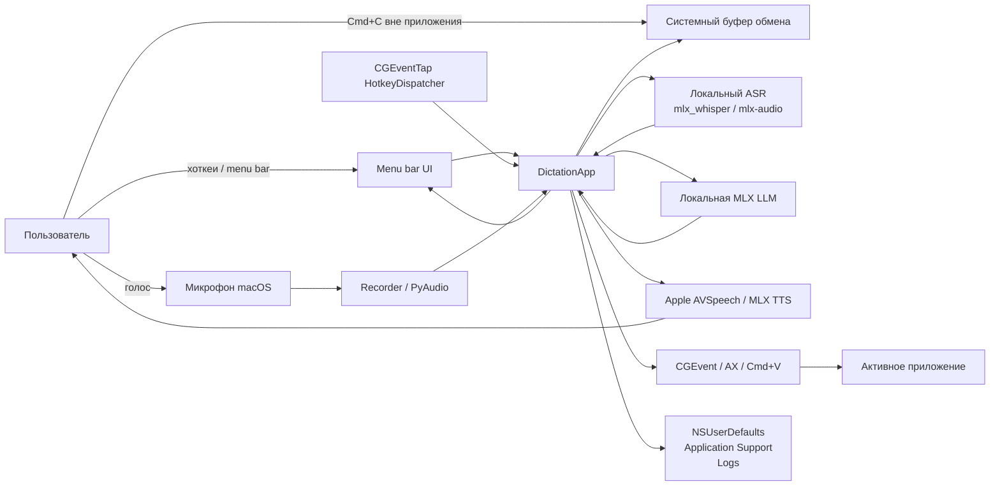
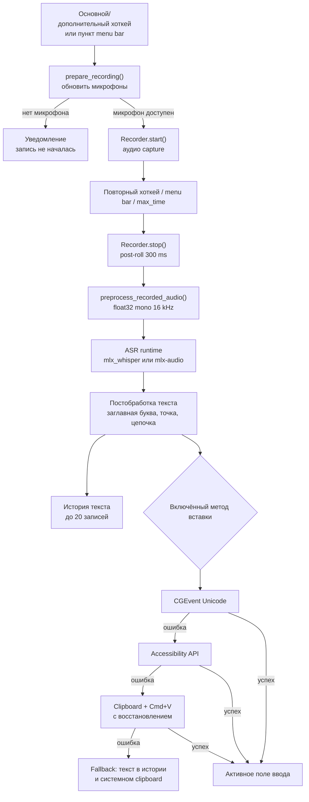
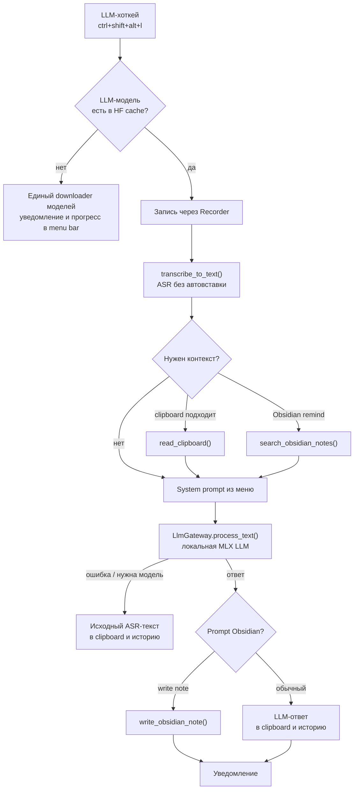
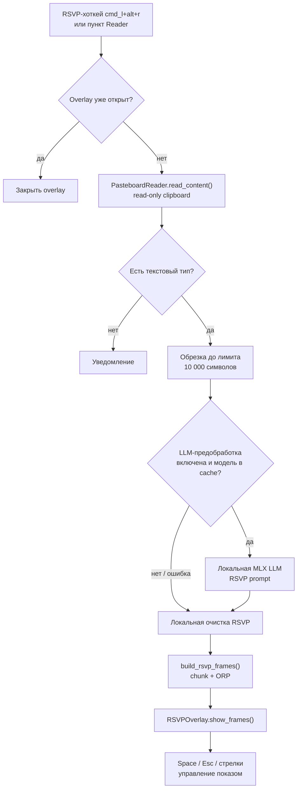
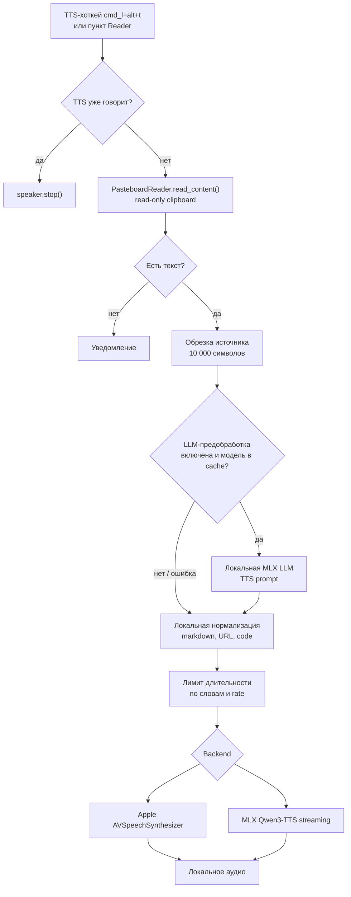
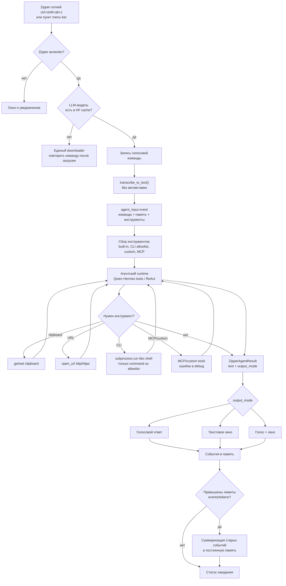
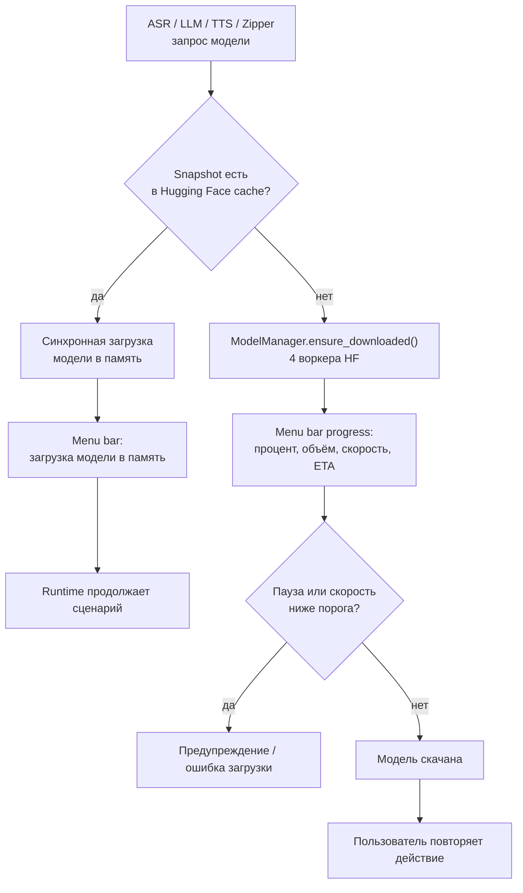

# Диаграммы потоков данных

Эти схемы являются **DFD: Data Flow Diagram**, то есть диаграммами потоков
данных. Они показывают не классы и не вызовы функций, а движение данных между
пользователем, macOS, use case-слоем, MLX runtime, persistence и UI.

## Контекстная DFD

## Обычная диктовка

## Whisper -> LLM

## Reader RSVP

## Reader TTS

## Zipper

## Загрузка моделей

