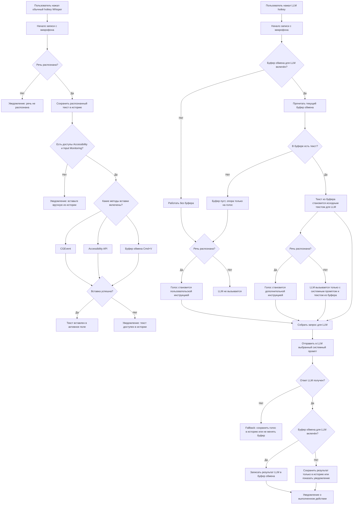

# Диаграмма пользовательского поведения

Этот документ фиксирует целевое поведение двух независимых пайплайнов:

- обычная диктовка через Whisper hotkey;
- обработка через LLM hotkey.

Цель документа: сначала договориться о пользовательской логике, а уже потом менять runtime-код.

## Главный принцип

Обычная диктовка и LLM-обработка должны восприниматься как два разных сценария:

- обычная диктовка: микрофон -> Whisper -> вставка текста;
- LLM-обработка: буфер обмена и/или голос -> LLM -> результат в буфере обмена.

При этом пункт меню «Буфер обмена для LLM» управляет только взаимодействием LLM-пайплайна с буфером обмена и не должен влиять на обычную диктовку.

## Предлагаемая диаграмма

## Правила для обычной диктовки

1. Обычный hotkey всегда работает только через микрофон.
2. Буфер обмена не является источником текста для обычной диктовки.
3. Пункт меню «Буфер обмена Cmd+V» в разделе методов вставки означает только способ доставки результата в активное поле.
4. Даже если вставка не удалась, распознанный текст не должен теряться: он должен оставаться в истории.

## Правила для LLM hotkey

1. LLM hotkey всегда стартует запись с микрофона, но голос не обязан быть единственным источником смысла.
2. Если включён пункт «Буфер обмена для LLM» и в буфере есть текст, этот текст становится основным входом для LLM.
3. Если пользователь ничего не продиктовал, но текст в буфере есть, LLM всё равно вызывается.
4. В этом режиме системный промпт работает прямо поверх текста из буфера.
5. Если текст в буфере есть и голос тоже есть, голос трактуется как дополнительная инструкция к тексту из буфера.
6. Если буфер для LLM выключен, сценарий работает как голосовой запрос к LLM без участия буфера.
7. Если буфер для LLM включён и ответ получен, итоговый текст кладётся в буфер обмена.
8. Уведомление для LLM должно сообщать факт выполненного действия, а не только сырой ответ модели.

## Рекомендуемая смысловая модель переключателей

На текущем этапе достаточно двух независимых переключателей:

- «Буфер обмена Cmd+V» — только для обычной диктовки и только как метод вставки результата в активное приложение;
- «Буфер обмена для LLM» — только для LLM-пайплайна и сразу для двух действий: читать исходный текст из буфера и записывать итог обратно в буфер.

Это проще для пользователя, потому что сохраняется симметрия:

- Whisper использует буфер только как механизм вставки;
- LLM использует буфер как источник и приёмник смысла.

Разделять LLM-переключатель на два отдельных пункта имеет смысл только если понадобится один из редких режимов:

- читать из буфера, но не писать обратно;
- не читать из буфера, но писать результат в буфер.

Пока такие сценарии выглядят вторичными, поэтому один переключатель для LLM выглядит практичнее.

## Что отличается от текущей реализации

Текущая реализация ещё не соответствует этой диаграмме полностью:

- сейчас LLM-пайплайн требует непустую транскрипцию, иначе LLM не вызывается;
- сейчас текст из буфера передаётся в LLM не как основной вход, а только как контекст;
- сейчас буфер подключается по эвристике на основе слов в голосовом запросе;
- сейчас уведомление LLM в основном показывает ответ модели, а не явно сформулированное действие.

## Следующий шаг

После подтверждения этой схемы можно переходить к реализации:

1. обновить сборку запроса для LLM;
2. изменить fallback-логику ветки без диктовки;
3. скорректировать уведомления;
4. добавить регрессионные тесты для сценариев с пустой диктовкой и текстом в буфере.